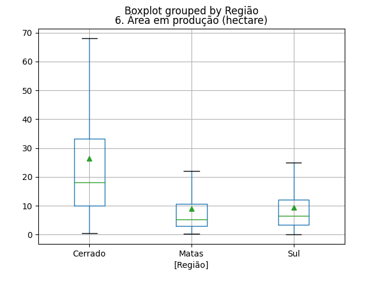
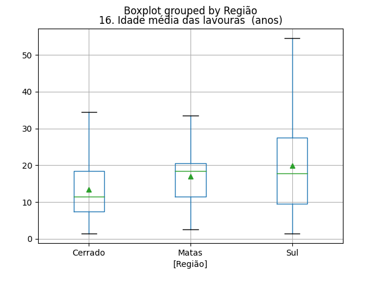
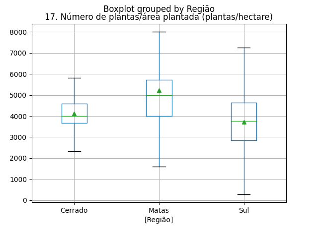
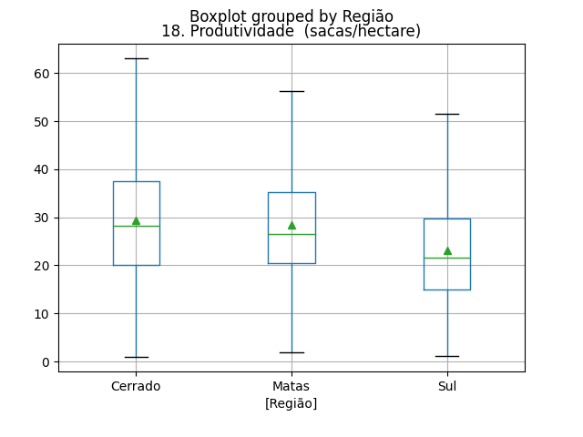
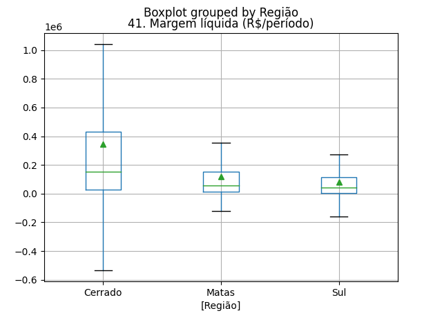
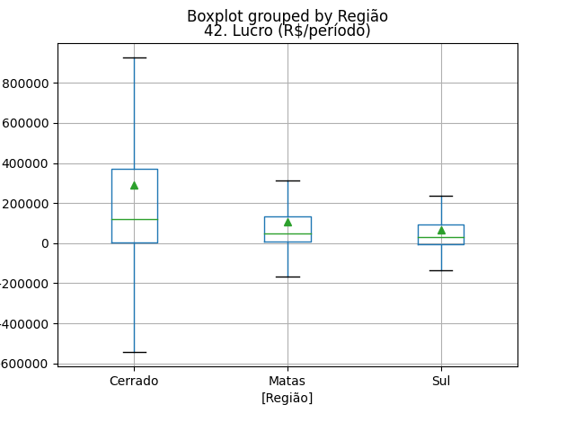
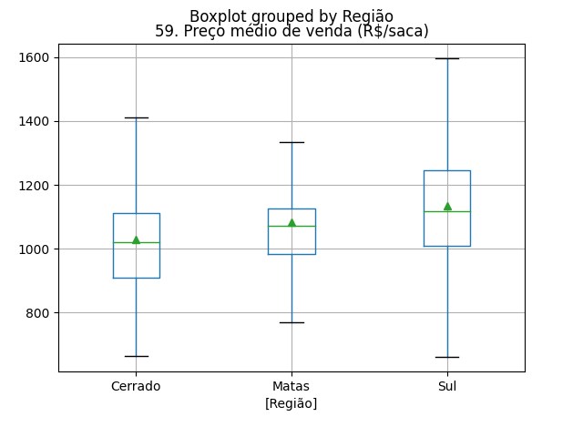
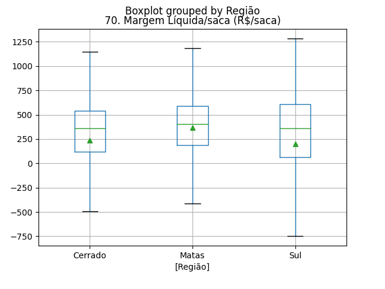
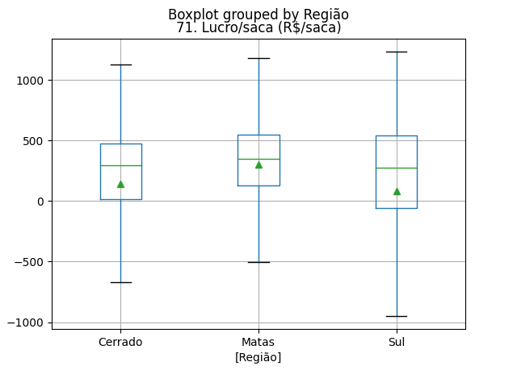

Análise Exploratória do Café
============================

## Área em produção (hectare)

||Cerrado|Matas|Sul|
| :---: | :---: | :---: | :---: |
|Min.|0.5|0.28|0.14|
|Máx.|68.0|22.0|24.92|
|Q1|10.0|3.0|3.405|
|Q3|33.2|10.74|12.09|
|Mediana|18.16|5.26|6.5|
|Média|26.3789|9.0154|9.3698|
  

## Idade média das lavouras  (anos)

||Cerrado|Matas|Sul|
| :---: | :---: | :---: | :---: |
|Min.|1.5|2.5|1.5|
|Máx.|34.5|33.5|54.5|
|Q1|7.5|11.5|9.5|
|Q3|18.5|20.5|27.5|
|Mediana|11.5|18.5|17.78|
|Média|13.4527|16.9685|19.9535|
  

## Número de plantas/área plantada (plantas/hectare)

||Cerrado|Matas|Sul|
| :---: | :---: | :---: | :---: |
|Min.|2324.56|1587.3|285.71|
|Máx.|5823.53|8000.0|7246.38|
|Q1|3663.0|4000.0|2846.0475|
|Q3|4583.33|5714.29|4629.63|
|Mediana|4000.0|5000.0|3759.4|
|Média|4129.5678|5218.6173|3710.8099|
  

## Produtividade  (sacas/hectare)

||Cerrado|Matas|Sul|
| :---: | :---: | :---: | :---: |
|Min.|1.02|1.88|1.16|
|Máx.|63.03|56.34|51.56|
|Q1|20.01|20.44|14.8925|
|Q3|37.5|35.31|29.685|
|Mediana|28.22|26.47|21.685|
|Média|29.4266|28.3363|23.086|
  

## Margem líquida (R$/período)

||Cerrado|Matas|Sul|
| :---: | :---: | :---: | :---: |
|Min.|-532220.85|-121734.69|-157312.07|
|Máx.|1040076.6|354209.34|275491.42|
|Q1|27668.19|14599.43|4647.53|
|Q3|433425.18|151465.92|113000.67|
|Mediana|152726.55|55247.56|41385.02|
|Média|344774.3055|120379.1389|82664.8296|
  

## Lucro (R$/período)

||Cerrado|Matas|Sul|
| :---: | :---: | :---: | :---: |
|Min.|-541198.46|-165729.96|-136446.11|
|Máx.|925074.7|314825.99|237497.78|
|Q1|3046.6|9040.21|-4035.6875|
|Q3|372509.81|133964.31|92786.125|
|Mediana|120467.87|48788.8|30842.855|
|Média|292624.0718|107331.4057|64653.9898|
  

## Preço médio de venda (R$/saca)

||Cerrado|Matas|Sul|
| :---: | :---: | :---: | :---: |
|Min.|664.22|768.32|661.72|
|Máx.|1410.97|1334.85|1595.87|
|Q1|909.52|982.33|1009.2075|
|Q3|1110.75|1126.66|1244.5075|
|Mediana|1020.44|1071.34|1116.285|
|Média|1027.4831|1082.1712|1133.1383|
  

## Margem Líquida/saca (R$/saca)

||Cerrado|Matas|Sul|
| :---: | :---: | :---: | :---: |
|Min.|-493.32|-413.48|-745.5|
|Máx.|1148.63|1186.16|1281.59|
|Q1|121.67|184.73|65.915|
|Q3|537.58|590.68|607.59|
|Mediana|359.8|403.88|359.34|
|Média|234.1152|365.9812|200.213|
  

## Lucro/saca (R$/saca)

||Cerrado|Matas|Sul|
| :---: | :---: | :---: | :---: |
|Min.|-671.61|-502.78|-947.65|
|Máx.|1125.51|1181.53|1230.78|
|Q1|13.96|125.17|-56.1175|
|Q3|476.84|550.57|539.29|
|Mediana|292.84|345.12|272.455|
|Média|143.3873|300.6138|83.4547|
  

