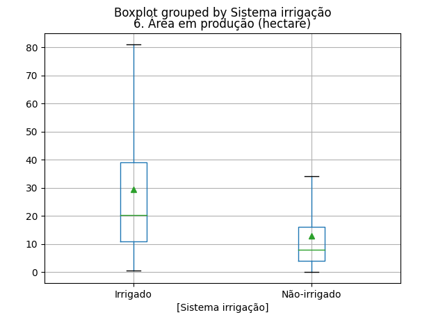
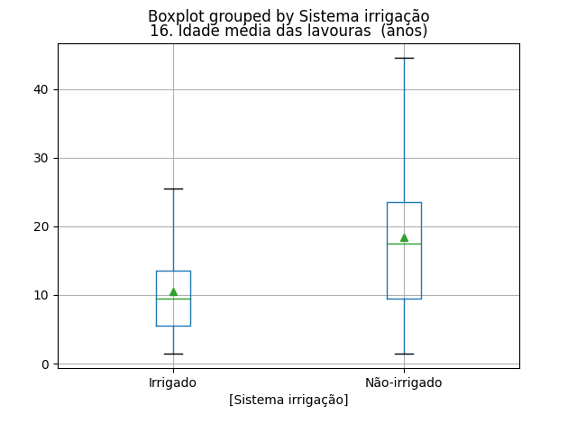
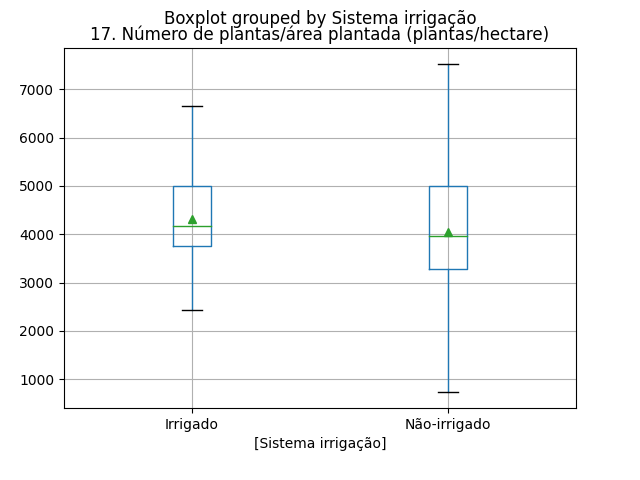
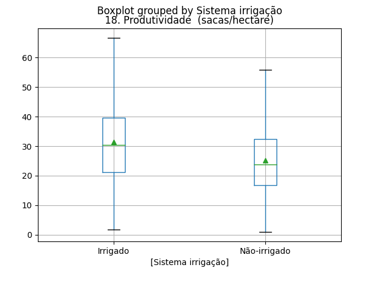
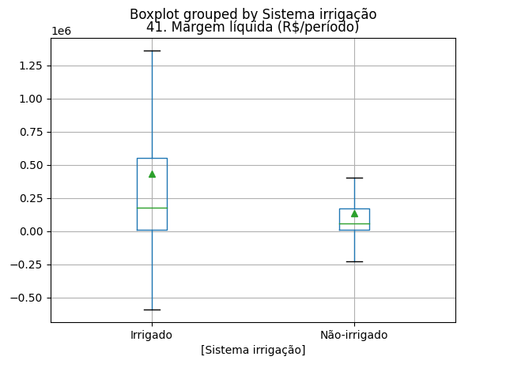
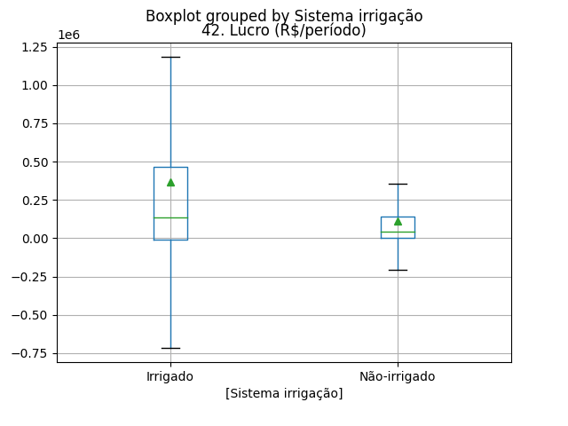
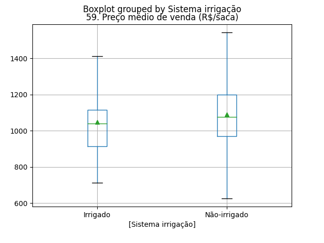
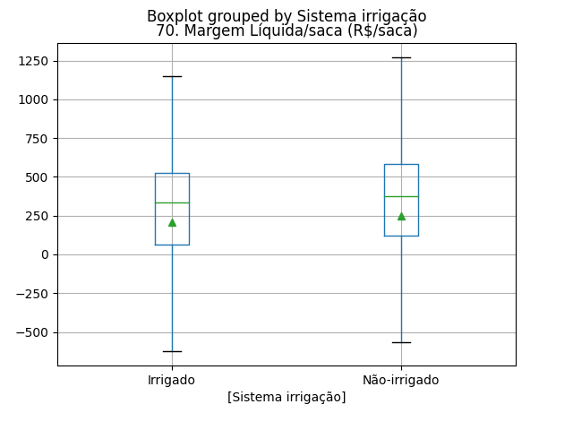
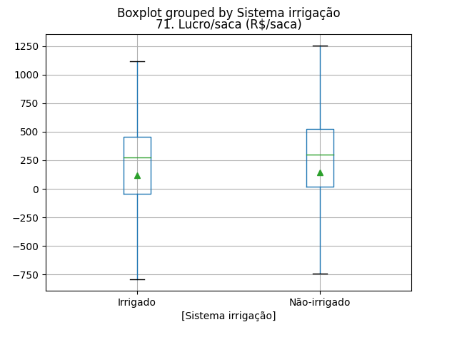

Análise Exploratória do Café
============================

## Área em produção (hectare)

||Irrigado|Não-irrigado|
| :---: | :---: | :---: |
|Min.|0.6|0.14|
|Máx.|81.0|34.16|
|Q1|11.0|4.0|
|Q3|39.2|16.08|
|Mediana|20.26|8.0|
|Média|29.5588|13.0004|
  

## Idade média das lavouras  (anos)

||Irrigado|Não-irrigado|
| :---: | :---: | :---: |
|Min.|1.5|1.5|
|Máx.|25.5|44.5|
|Q1|5.5|9.5|
|Q3|13.5|23.5|
|Mediana|9.5|17.495|
|Média|10.483|18.4628|
  

## Número de plantas/área plantada (plantas/hectare)

||Irrigado|Não-irrigado|
| :---: | :---: | :---: |
|Min.|2426.9|741.67|
|Máx.|6666.67|7518.8|
|Q1|3759.4|3289.47|
|Q3|5000.0|5000.0|
|Mediana|4166.67|3968.25|
|Média|4312.5788|4044.1134|
  

## Produtividade  (sacas/hectare)

||Irrigado|Não-irrigado|
| :---: | :---: | :---: |
|Min.|1.67|1.02|
|Máx.|66.6|55.78|
|Q1|21.22|16.69|
|Q3|39.595|32.3425|
|Mediana|30.335|23.765|
|Média|31.4125|25.194|
  

## Margem líquida (R$/período)

||Irrigado|Não-irrigado|
| :---: | :---: | :---: |
|Min.|-587895.38|-226408.76|
|Máx.|1358069.4|404955.93|
|Q1|11844.725|10279.975|
|Q3|551937.49|169210.95|
|Mediana|176671.355|57414.915|
|Média|433794.9709|135959.1372|
  

## Lucro (R$/período)

||Irrigado|Não-irrigado|
| :---: | :---: | :---: |
|Min.|-713795.93|-208462.29|
|Máx.|1182228.16|356721.06|
|Q1|-11472.3875|1546.6475|
|Q3|467434.8875|143766.79|
|Mediana|133740.605|45665.715|
|Média|369561.7222|112898.3698|
  

## Preço médio de venda (R$/saca)

||Irrigado|Não-irrigado|
| :---: | :---: | :---: |
|Min.|712.62|627.09|
|Máx.|1410.97|1542.47|
|Q1|914.37|970.14|
|Q3|1116.2875|1200.055|
|Mediana|1041.265|1077.115|
|Média|1047.3763|1090.8088|
  

## Margem Líquida/saca (R$/saca)

||Irrigado|Não-irrigado|
| :---: | :---: | :---: |
|Min.|-622.11|-564.26|
|Máx.|1148.63|1268.79|
|Q1|65.1975|122.6175|
|Q3|526.9575|582.295|
|Mediana|335.105|373.94|
|Média|208.3424|245.5257|
  

## Lucro/saca (R$/saca)

||Irrigado|Não-irrigado|
| :---: | :---: | :---: |
|Min.|-790.97|-742.32|
|Máx.|1119.37|1253.37|
|Q1|-42.8025|16.95|
|Q3|458.7825|524.54|
|Mediana|272.255|297.78|
|Média|116.091|145.2619|
  
