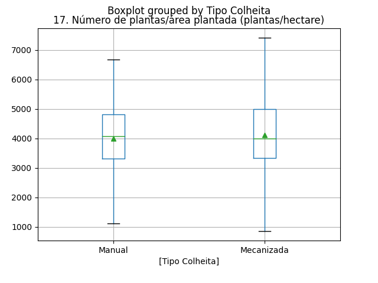

Análise Exploratória do Café
============================

## Área em produção (hectare)

||Manual|Mecanizada|
| :---: | :---: | :---: |
|Min.|0.44|0.14|
|Máx.|29.4|45.24|
|Q1|3.955|4.795|
|Q3|14.325|21.0|
|Mediana|7.4|10.155|
|Média|12.7419|16.9423|
  

## Idade média das lavouras  (anos)

||Manual|Mecanizada|
| :---: | :---: | :---: |
|Min.|1.5|1.5|
|Máx.|47.5|39.5|
|Q1|5.5|9.5|
|Q3|22.5|21.5|
|Mediana|11.025|14.5|
|Média|15.8679|16.9592|
  

## Número de plantas/área plantada (plantas/hectare)

||Manual|Mecanizada|
| :---: | :---: | :---: |
|Min.|1116.07|866.07|
|Máx.|6666.67|7407.41|
|Q1|3326.6675|3345.8325|
|Q3|4812.735|5000.0|
|Mediana|4081.63|4000.0|
|Média|3995.721|4114.4606|
  

## Produtividade  (sacas/hectare)

||Manual|Mecanizada|
| :---: | :---: | :---: |
|Min.|1.02|1.16|
|Máx.|52.15|59.46|
|Q1|15.69|17.695|
|Q3|30.91|34.47|
|Mediana|22.35|25.36|
|Média|24.2153|26.8028|
  

## Margem líquida (R$/período)

||Manual|Mecanizada|
| :---: | :---: | :---: |
|Min.|-195319.74|-308814.37|
|Máx.|312039.4|549572.63|
|Q1|-6783.3575|12627.785|
|Q3|122206.415|227481.16|
|Mediana|38488.87|74029.66|
|Média|108582.5848|210170.829|
  

## Lucro (R$/período)

||Manual|Mecanizada|
| :---: | :---: | :---: |
|Min.|-177810.24|-285990.46|
|Máx.|258096.61|485727.63|
|Q1|-14652.08|3054.7625|
|Q3|96031.6125|197189.57|
|Mediana|24159.785|56933.205|
|Média|82550.9868|177834.9095|
  

## Preço médio de venda (R$/saca)

||Manual|Mecanizada|
| :---: | :---: | :---: |
|Min.|598.8|664.22|
|Máx.|1595.87|1472.79|
|Q1|944.86|966.73|
|Q3|1212.275|1169.2825|
|Mediana|1068.445|1070.58|
|Média|1075.5926|1082.7841|
  

## Margem Líquida/saca (R$/saca)

||Manual|Mecanizada|
| :---: | :---: | :---: |
|Min.|-1010.82|-535.38|
|Máx.|1186.63|1234.83|
|Q1|-83.195|132.23|
|Q3|544.26|578.3725|
|Mediana|276.36|375.775|
|Média|94.5815|258.7407|
  

## Lucro/saca (R$/saca)

||Manual|Mecanizada|
| :---: | :---: | :---: |
|Min.|-1205.45|-700.08|
|Máx.|1125.51|1253.37|
|Q1|-204.5925|28.83|
|Q3|470.7925|519.795|
|Mediana|185.005|302.75|
|Média|-20.5575|162.5323|
  
